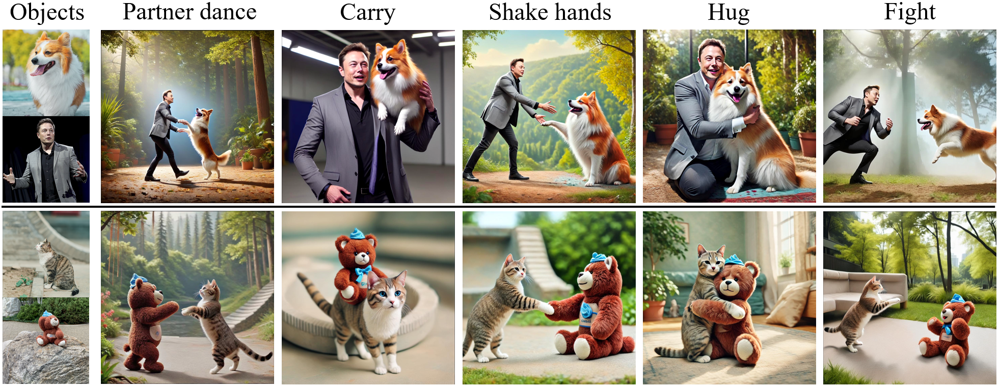

<br />
<p align="center">
  <h1 align="center">DreamRelation: Bridging Customization and Relation Generaion [CVPR 2025]</h1>
  <p align="center">
    <a href="https://scholar.google.com.hk/citations?user=VpSqhJAAAAAJ&hl=zh-CN"><strong>Qingyu Shi</strong></a>
    ·
    <a href="http://luqi.info/"><strong>Lu Qi</strong></a>
    ·
    <a href="https://jianzongwu.github.io/"><strong>Jianzong Wu</strong></a>
    ·
    <a href="https://noyii.github.io/"><strong>Jinbin Bai</strong></a>
    ·
    <a href="https://wangjingbo1219.github.io/"><strong>Jingbo Wang</strong></a>
    ·
    <a href="https://scholar.google.com/citations?user=T4gqdPkAAAAJ&hl=zh-CN"><strong>Yunhai Tong</strong></a>
    ·
    <a href="https://lxtgh.github.io/"><strong>Xiangtai Li</strong></a>
  <br >
     PKU, Insta360 Research, NTU, NUS, Shanghai AI
  </p>

  <p align="center">
    <a href='https://arxiv.org/pdf/2410.23280'></a> &ensp;
    <a href='https://shi-qingyu.github.io/DreamRelation.github.io/'> </a> &ensp;
    <a href='https://huggingface.co/QingyuShi/DreamRelation'> </a> &ensp;
  </p>
<br/>

## Introduction


In our Relation-Aware Image Customization task, the generated images must accurately preserve the relationships between objects and maintain their identity. We highlight the limitations of previous approaches using three color codes: red indicates **failure to capture relationships**, blue marks **missing objects**, and orange represents **object confusion**. Each image is annotated to reflect its specific issue. Our results, highlighted by green boxes, demonstrate the advantages of our proposed method.



## Requirements
Install the packages:
```bash
pip install -r requirements.txt
```

## Model Preparation
```bash
export HF_ENDPOINT=https://hf-mirror.com
huggingface-cli download doge1516/MS-Diffusion --local-dir ./checkpoints/MS-Diffusion
```

## Data Preparation
Please prepare datasets and organize them like the 
following:

```text
├── data
    ├── shaking_hands
        ├── videos
            ├── 0
                ├──concept0.png
                ├──concpet1.png
                ├──motion.png
                ├──concept_keyposes_one.pth
                ├──concept_keyposes_two.pth
            ├── 1
            ...
        ├── masks
        ├── prompts.json
    
```

## Training
Please replace the model and data paths before running the script：
```
bash train.sh
```
<!-- The code will be release soon!!! Please stay tuned. -->

## Inference
Please replace the model and data paths before running the script：
```
python inference.py --config config/example_two_objects.yaml
```
<!-- The code will be release soon!!! Please stay tuned. -->

## Citation
```
@inproceedings{DreamRelation,
  title={DreamRelation: Bridging Customization and Relation Generaion},
  author={Qingyu Shi, Lu Qi, Jianzong Wu, Jinbin Bai, Jingbo Wang, Yunhai Tong, Xiangtai Li},
  booktitle={CVPR},
  year={2025}
}
```